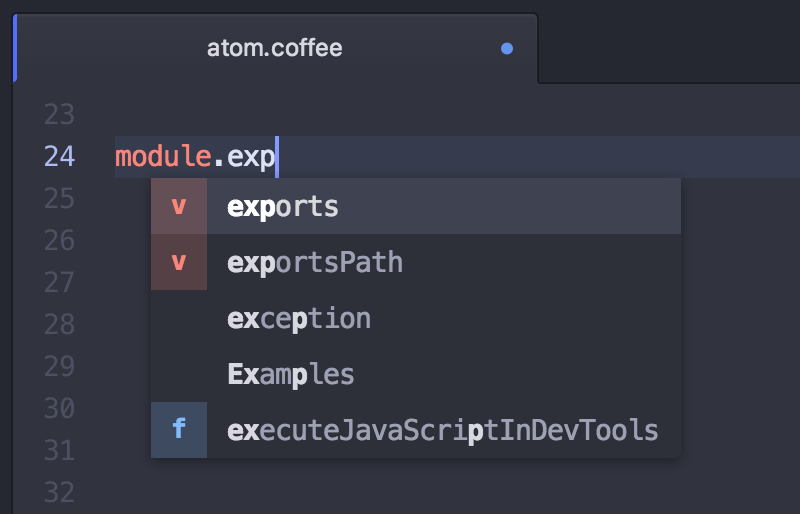

# 自动补全

如果你还想节约一些打字时间，Atom 自带简单的自动补全功能。

按下 `ctrl-space`，自动补全工具可以展示并插入可选的完整单词。

图 1. 自动补全菜单

自动补全工具默认会在当前打开的文档里匹配你正在输入的单词。

如果你想要更多的补全选项，在 autocomplete-plus 包的 Settings 面板里有开关，控制自动补全工具是在所有打开的缓冲区，还是只在当前文件里匹配单词。

自动补全功能在 [atom/autocomplete-plus](https://github.com/atom/autocomplete-plus) 这个 package 里实现。
