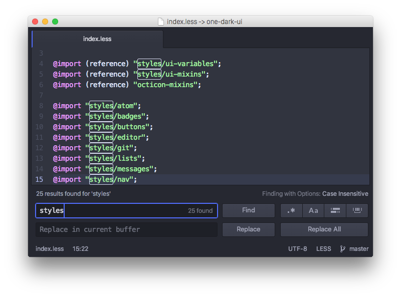

<!-- 译者：Github@wizardforcel -->

# 查找和替换

在 Atom 里能非常方便快捷地在文件或者项目范围内进行文本查找和替换。

`cmd-F`：在缓冲区中查找

`cmd-shift-f`：在整个项目中查找

如果执行了上面某一个命令，在屏幕的底部会出现一个 `Find and Replace` 面板。

图 1. 在当前文件查找和替换

按下 `cmd-F` 并输入字符串可以在当前文件中查找，多次按下回车（或 `cmd-G`，或者 `Find Next` 按钮）能循环查找当前文件中的匹配内容。`Find and Replace` 面板里提供了选项，可以设置大小写敏感，正则表达式匹配和区域搜索等。

在 `Replace in current buffer` 文本框中输入字符串，可以将匹配到的结果替换成另一个字符串。例如，如果你想要把所有的 `Scott` 都替换成 `Dragon` ，你可以把它们填到两个文本框中，然后点击 `Replace All` 按钮。

在按下 `cmd-shift-F` 弹出的面板里，可以对整个项目范围内进行查找和替换。

图 2. 在项目范围内查找和替换

这是一个很好的功能，可以用于找到项目里某个函数的所有调用，所有连接某个锚文本的地方，或者某个错误拼写的所有位置。点击查找结果列表里的某一行可以跳转到对应的位置。

在 `File/Directory pattern` 文本框中输入 [glob pattern](http://en.wikipedia.org/wiki/Glob_%28programming%29) (*译者注：通配符*)，能把搜索范围限制在项目全部文件的某个子集。在打开了多个项目文件夹时，这个功能还可以用于在其中一个文件夹中查找。例如，你打开了 `/path1/folder1` 和 `/path2/folder2`，你可以输入一个以 `folder1` 开头的通配符，只在第一个文件夹中查找。

当焦点在 `Find and Replace` 面板上的时候，按 `escape` 键可以隐藏它。

查找和替换功能在 [atom/find-and-replace](https://github.com/atom/find-and-replace) 这个 package 中实现，并且使用了 [atom/scandal](https://github.com/atom/scandal) 这个 package 执行实际的查找。
