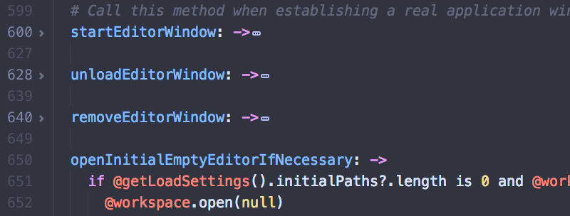

# 折叠 
 
如果仅仅希望看到你所处理的代码文件的结构概览，折叠会是个非常有用的工具。折叠可以隐藏像函数和循环这样的代码块，来简化你屏幕上显示的东西。
 
把鼠标移到数字栏上，点击显示的箭头来折叠代码段，也可以使用快捷键组 `alt-cmd-[` 和 `alt-cmd-]` 来折叠和展开代码段。 
 
 

图 1. 折叠和展开代码段

使用 `alt-cmd-shift-{` 和 `alt-cmd-shift-}` 键组来折叠和展开所有代码段，使用 `cmd-k cmd-N` 来指定折叠的缩进级别，其中 N 是缩进深度。 
 
选中你想折叠的代码或文本块，通过按下 `ctrl-alt-cmd-F`，或者在命令面板中选择 `Fold Selection`，可以折叠起代码或文本的任意一部分。 
