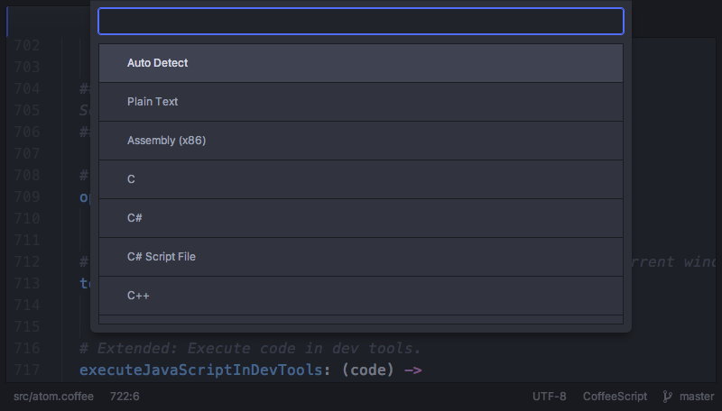

<!-- 译者：Github@wizardforcel -->

# 语法

一个缓冲区的“语法”，是 Atom 所认为的文件内容的语言，可能是 Java 或者 Markdown（或者其它的），我们在 Snippets 一节中创建代码段的时候已经见识过这一点了。

加载了一个文件以后，Atom 会做一些事情来试图识别出文件的类型。大部分情况下，Atom 会通过文件的扩展名（`.md` 通常是一个 Markdown 文件，等等）来完成这项工作，但有时只通过扩展名难以判断，它会对文件内容进行一些检查来确定。

如果加载了一个 Atom 无法判断语法的文件，它会默认为是最简单的纯文本类型（Plain Text）。如果它把文件默认为纯文本，或者弄错了文件类型，再或者由于一些原因你想修改文件的当前作用语法，可以按下 `ctrl-shift-L` 调出语法选择器。

一旦手动修改了一个文件的语法，Atom 会记住它，除非你将语法设置回自动检测，或者手动选择一个不同的语法。

语法选择器的功能在 [atom/grammar-selector](https://github.com/atom/grammar-selector) 这个 package 里实现。
