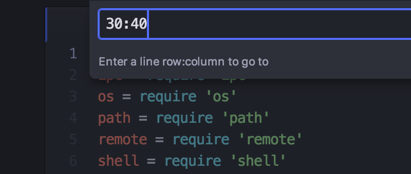

# 在 Atom 里移动

虽然使用鼠标和方向键在 Atom 里移动已经足够简单，Atom 还额外提供了一些快捷键，能让你的手不用离开键盘，更快地在文档中导航。

首先，Atom 自带了许多 Emacs 快捷键用于在文档中导航。你可以使用 `ctrl-P` 和 `ctrl-N` 来将光标上移或下移一个字符，使用 `ctrl-B` 和 `ctrl-F` 将光标左移或右移一个字符。这和使用方向键是一样的，但有些人不喜欢把手移到方向键的位置。

除了以单个字符为单位的移动，还有许多其它用于移动的快捷键。

`alt-B`，`alt-left`：移到词首

`alt-F`，`alt-right`：移到词尾

`cmd-right`，`ctrl-E`：移到行尾

`cmd-left`，`ctrl-A`：移到本行第一个字符

`cmd-up`：移到文件开头

`cmd-down`：移到文件末尾

你也可以使用 `ctrl-G` 直接移动到某一行（和列），按 `ctrl-G` 后会弹出一个对话框询问你想跳到哪一行，也可以输入 `row:column` 来跳到那一行的某个字符。

图 1. 直接跳到某一行

## 通过符号（Symbols）导航

你也可以通过其它信息来跳转。可以使用 `cmd-r` 来跳转到方法定义之类的符号，按键之后会在 Atom 里打开一个包含当前文件中所有符号的列表，可以根据符号进行模糊查找，`cmd-t` 与此类似，能对项目里的文件名进行模糊查找。如果想在整个项目范围内查找符号，可以使用 `cmd-shift-r`。

图 2. 在项目范围内查找符号

你还可以使用 `ctrl-alt-down` 直接跳转到光标下的方法或函数的声明。

首先你需要确保已经为你的项目生成了 `tags`（或者 `TAGS`）文件。`tags` 文件是通过 [ctags](http://ctags.sourceforge.net/) 生成的，安装 ctags，在项目的根目录运行 `ctags -R src/` 即可。

如果你在 Mac 下并且使用 [Homebrew](http://brew.sh/)，可以运行 `brew install ctags` 来安装 ctags。

你可以在 home 目录下创建一个 `.ctags` 文件（`~/.ctags`）来自定义生成 tags 文件的规则。在 [这个链接](https://github.com/atom/symbols-view/blob/master/lib/ctags-config) 能看到一个示例。

通过符号导航的功能是在 [atom/symbols-view](https://github.com/atom/symbols-view) 这个 package 里实现的。

## Atom 书签
