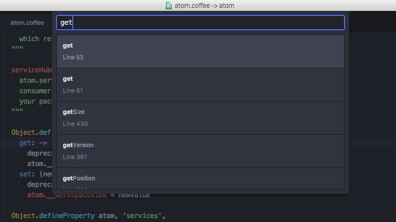
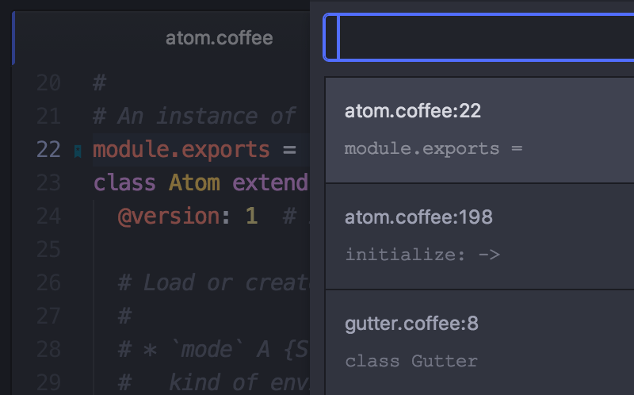

# 在 Atom 里移动

虽然使用鼠标和方向键在 Atom 里移动已经足够简单，但 Atom 还额外提供了一些快捷键，能让你的手不用离开键盘，更快地在文档中导航。

首先，Atom 复用了许多 Emacs 快捷键用于在文档中导航。比如你可以使用 `ctrl-P` 和 `ctrl-N` 来将光标上移或下移一个字符，使用 `ctrl-B` 和 `ctrl-F` 将光标左移或右移一个字符。这和使用方向键的效果是一样的，很适合那些不喜欢把手移到方向键位置的人。

除了以单个字符为单位的移动，还有许多其它用于移动的快捷键。

`alt-B`，`alt-left`：移到词首

`alt-F`，`alt-right`：移到词尾

`cmd-right`，`ctrl-E`：移到行尾

`cmd-left`，`ctrl-A`：移到行首

`cmd-up`：移到文件开头

`cmd-down`：移到文件末尾

你也可以使用 `ctrl-G` 直接移动到某一行（和列），按 `ctrl-G` 后会弹出一个对话框询问你想跳转到哪一行，这时也可以输入 `row:column` 来跳到那一行的某个字符。

图 1. 直接跳到某一行

## 通过符号（Symbols）导航

你也可以通过其它信息来跳转。可以使用 `cmd-r` 来跳转到方法定义之类的符号，按键之后会在 Atom 里打开一个包含当前文件中所有符号的列表，可以根据符号进行模糊查找，`cmd-t` 与此类似，能对项目里的文件名进行模糊查找。如果想在整个项目范围内查找符号，可以使用 `cmd-shift-r`。

图 2. 在项目范围内查找符号

你还可以使用 `ctrl-alt-down` 直接跳转到光标下的方法或函数的声明。

当然首先你需要确保已经为你的项目生成了 `tags`（或者 `TAGS`）文件。`tags` 文件是通过 [ctags](http://ctags.sourceforge.net/) 生成的，安装 ctags，在项目的根目录运行 `ctags -R src/` 即可。

如果你在 Mac 下并且使用 [Homebrew](http://brew.sh/)，可以运行 `brew install ctags` 来安装 ctags。

你可以在 home 目录下创建一个 `.ctags` 文件（`~/.ctags`）来自定义生成 tags 文件的规则。在 [这个链接](https://github.com/atom/symbols-view/blob/master/lib/ctags-config) 能看到 `.ctags` 文件示例。

通过符号导航的功能是在 [atom/symbols-view](https://github.com/atom/symbols-view) 这个 package 里实现的。

## Atom 书签

Atom 还有一个非常棒的功能，就是可以给一些指定的行添加书签，然后就能快速地跳转到这些书签所在的位置。

可以按 `cmd-F2` 给当前行添加书签，再按一次是取消书签。你可以给项目里多个重要位置设置书签，然后使用它们来快速查找和跳转到这些地方。添加书签后，在行号后面会出现一个小的书签标记，效果见下面图中第 22 行。

按 `F2` 会跳转到当前文件里的下一个书签，按 `shift-F2` 会跳转到上一个书签。

按 `ctrl-F2` 会列出项目里的所有书签，然后就能快速地筛选并跳转到它们中的某一个。

图 3. 查看和筛选书签

书签功能是在 [atom/bookmarks](https://github.com/atom/bookmarks) 这个 package 里实现。
