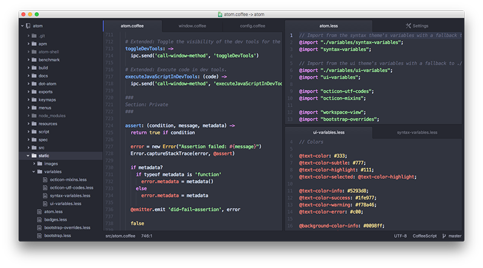

<!-- 译者：Github@wizardforcel -->
<!-- 校对：zxning -->

# 面板 #

你可以通过使用 `cmd-K` `上下左右` 快捷键(译者注:按住 `cmd-k` 之后，松开键盘，再按上下左右方向键)来横向或者纵向分割编辑器的面板，其中箭头的方向就是要分割的方向。面板被分割后，你可以使用 `cmd-K` `cmd-上下左右` 快捷键在它们之间移动焦点，其中方向键的指向就是焦点要移动的方向。

每个面板都有自己的“面板项”，它们由标签来表示。你可以通过鼠标拖拽对应文件的标签在面板之间来回移动该文件，并把它放到想要放的面板中。

> 如果你不喜欢使用标签，也可以不使用。你可以禁用 [tabs package](https://github.com/atom/tabs) ，这样每个面板将仍然支持多面板项，只是你就没有标签来用于点击切换面板项了。

要关闭面板时，可以使用 `Ctrl+W` 来关闭面板项（译者注：按一次 `cmd-w` ,可以关闭一个面板项，关闭全部的面板项可以多按几次 `cmd-W` ）。在设置面板的 Core Settings 里的 `Remove Empty Panes` 选项可以配置当面板为空（最后一个面板项被关闭）时是否自动关闭面板。
