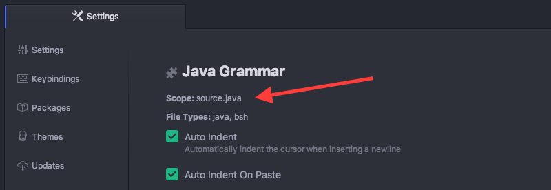

# 代码段 #

代码段是用来快速生成常用的代码语法的一个强大和快捷的方式。

其工作思路是，输入 `habtm` 这样的东西，按下回车键 `Tab`，就会扩展为 `has_and_belongs_to_many`。

许多包自带它们自己特定的代码段。比如，为 HTML 高亮和语法提供支持的 `language-html` 包，提供了许多代码段，来创建可能想要的各种 HTML 标签。如果你在 Atom 中创建一个新的 HTML 文件，可以输入`html` 然后按下 `Tab`，它会扩展为：

```html
<html>
  <head>
    <title></title>
  </head>
  <body>

  </body>
</html>
```

同时它会把光标定位在 `title` 标签的中间，以便你可以立即开始填充这个标签。许多代码段具有多个焦点位置，通过按下 `Tab` 在他们之间切换 —— 比如，在上例 HTML 代码段之中，当填充完标题标签之后，可以按下 `Tab` 键，然后光标就会移动到 `body` 标签之间。

要查看当前打开文件拥有的所有可用代码段，你可以按下 `Alt+Shift+S`。


图 1. 查看当前文件可用代码段

在选择输入框中输入内容，可以使用模糊搜索过滤这个列表。选择列表中一个之后生成相应代码段，在光标（或多重光标）所在位置插入代码。

## 创建你自己的代码段 ##

所以说这样太爽了。但是，如果想使用语言包中没有，或者编写代码中自定义的东西，又要怎么做呢？很幸运的是，你可以非常便利地添加自己的代码段。

`~\.atom` 目录下的 `snippets.cson` 文本文件，存放了所有自定义的代码段，它们会在 Atom 运行时加载。通过 `File > Snippets` 菜单，打开这个文件。

### 代码段的格式 ###

现在让我们看一看如何编写代码段，基本的代码段格式如下所示：

```coffeescript
'.source.js':
  'console.log':
    'prefix': 'log'
    'body': 'console.log(${1:"crash"});$2'
```

最顶层的键是选择器，即指定加载代码段的范围。获知此择器是什么值最简单的方法，是访问你想要添加代码段的语言的语言包，并找到 `Scope` 字符串。

例如，想要添加在 Java 文件中工作的代码段，应该先在 `Settings` 视图中寻找 `language-java` 包，可以看到 Scope 是 `source.java`，因此代码段最顶层的键就应该是它前面加上一个点（就像 CSS 选择器那样）。



图 2. Java 文件中的 Scope

下一层的键是代码段的名字，用于在代码段菜单中，以一个更具可读性的方式来描述代码段。可以将代码段命名为任何想要的名字。

在每个代码段的名字下面， `prefix` 用于触发代码段，`body` 是代码段被触发后插入的主体 。

每个后面带有数字的 `$` 是 Tab 的驻留位置。一旦代码段被触发，通过按下 `Tab` 键来遍历它们。具有相同数字的 Tab 停止位置将会创建多个光标。

上面的例子向 Javascript 文件添加了 `log` 代码段，它会被扩展为：

```coffeescript
console.log("crash");
```

其中的 `crash` 字符串会在开始时被选中，再次按下 `Tab` 键之后，光标会移动到分号之后。

>并不像 CSS 选择器，代码段的键每层只能重复一次。如果某一层有重复的键，只有最后的那个会被读到，详见[配置 CSON](http://flight-manual.atom.io/using-atom/sections/basic-customization/#configuring-with-cson)。

### 多行代码段主体 ###

可以使用 [CoffeeScript 多行语法](http://coffeescript.org/#strings)的 `"""` 来创建长模板。

```coffeescript
'.source.js':
  'if, else if, else':
    'prefix': 'ieie'
    'body': """
      if (${1:true}) {
        $2
      } else if (${3:false}) {
        $4
      } else {
        $5
      }
    """
```

如你所料，存在一个可创建代码段的代码段。如果你打开一个代码段文件，输入 `snip` 之后按下 `Tab`，会将以下内容插入到文件中：

```coffeescript
'.source.js':
  'Snippet Name':
    'prefix': 'hello'
    'body': 'Hello World!'
```

这样就有了你自定义的代码段。只要保存了文件，Atom 就会重新加载它，你也就能立即使用它了。

代码段功能在 [atom/snippets](https://github.com/atom/snippets) 包中实现。

更多代码段的例子请见 [language-html](https://github.com/atom/language-html/blob/master/snippets/language-html.cson) 和 [language-javascript](https://github.com/atom/language-javascript/blob/master/snippets/language-javascript.cson) 包。
